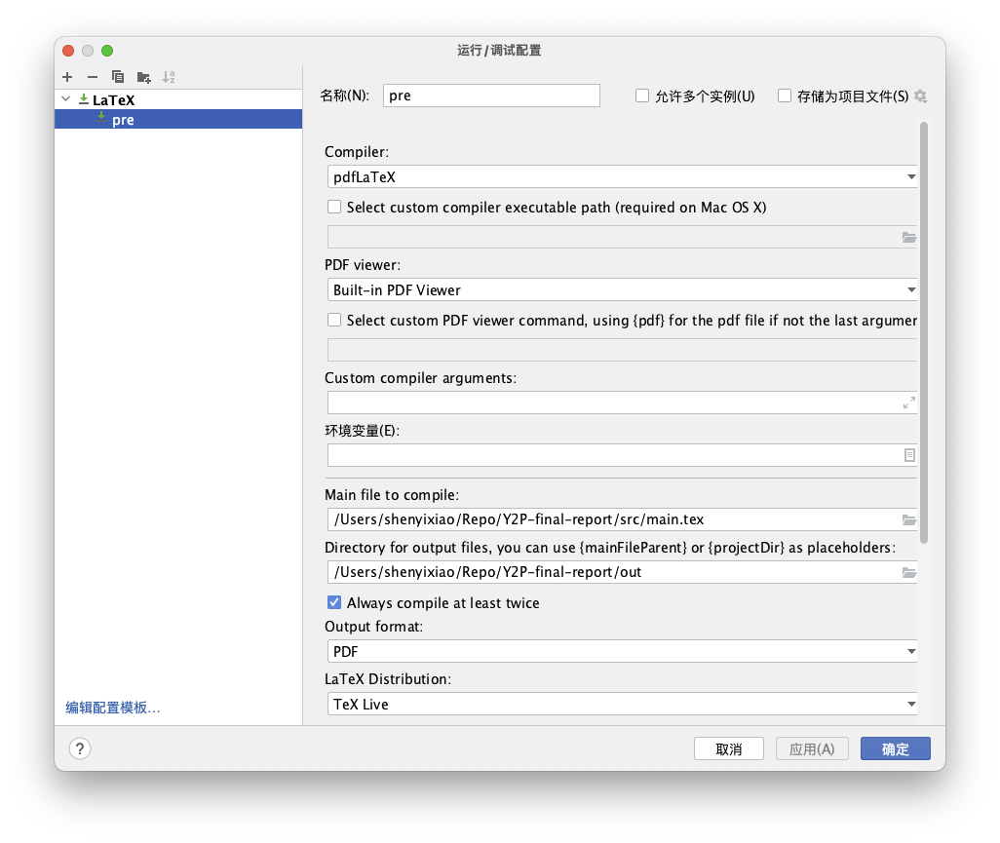

# Manual
This Latex repo is based on [TeXiFy IDEA](https://github.com/Hannah-Sten/TeXiFy-IDEA) (an IntelliJ IDEs Plugin). You can install the plugin on any IntelliJ editor, such as CLion or Pycharm. However, to compile the codes, ensure you have a basic TeX/LaTeX core on your computer. Relevant instructions is [here](https://github.com/Hannah-Sten/TeXiFy-IDEA/wiki/Installation).
### Configuration
Once you have installed the plugin and one Latex distribution, run a configuration as below, especially the "Main file to compile" & "Directory for output files" two paths. Then you may have a corresponding PDF generated. If not, feel free to ask me.

### Joint working
To make changes to the repo and avoid pushing directly to the main branch, it is recommended to use [GIT](https://git-scm.com/book/en/v2) and create a new branch. 

If you're not familiar with GIT, you can use the [issue boards](https://github.com/UOL-Y2P-WearableSensor/Final-Report/issues) on GitHub or WhatsApp to discuss changes and coordinate with team members. This helps maintain the stability and integrity of the main branch, and allows for more organized and collaborative development.